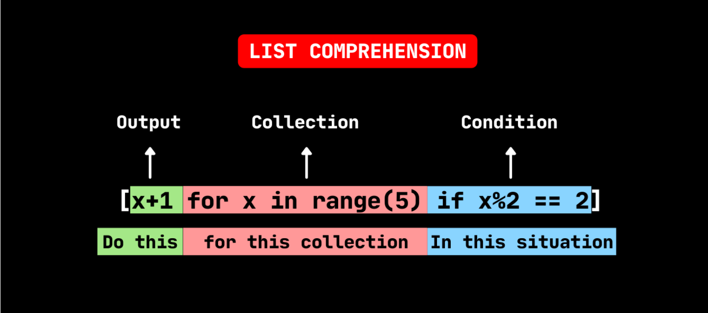

# Arrays / Lists

In Python, you can define an array-like structure using a list. A list is a built-in data type that allows you to store a collection of elements, which can be of different data types, such as integers, strings, or even other lists. Here's how you can define a list in Python:

```python
my_list = [1, 2, 3, 4, 5]  # Creating a list of integers

my_strings = ["apple", "banana", "cherry"]  # Creating a list of strings

mixed_list = [1, "hello", 3.14, True]  # Creating a list with mixed data types

```

In the examples above:

- `my_list` is a list containing integers.
- `my_strings` is a list containing strings.
- `mixed_list` is a list containing elements of different data types.

You can access elements in a list by their index, where the first element has an index of 0, the second element has an index of 1, and so on. For example:

```python
print(my_list[0])  # Access the first element of my_list (prints 1)
print(my_strings[1])  # Access the second element of my_strings (prints "banana")

```

<aside>
💡 Remember :  PYTHON USES ZERO INDEXING !

</aside>

**Common Array Operations:**

- Arrays (or lists) support various common operations such as appending, inserting, and deleting elements.
- You can append an element to the end of an array using the `append()` method, like `names.append('Alice')`.
- To insert an element at a specific position, you can use the `insert()` method, e.g., `names.insert(2, 'Bob')` inserts 'Bob' at index 2.
- Removing elements can be done with methods like `remove()` to remove a specific value, and `pop()` to remove an element by index.
- You can use the `del` statement to delete elements by index or clear the entire array, like `del names[0]` or `del names[:]`.

**Accessing Array Elements:**

- You can access elements in an array (or list) using square brackets `[]`.
- To print the last element of an array, you can use negative indexing, like `name[-1]`.

**Changing Array Elements:**

- You can change the value of an element in an array by assigning a new value to it, like `names[0] = 'Hanis'`.

**Slicing Arrays:**

- Slicing allows you to select a range of values from an array.
- You use a colon `:` to specify the start and end of the slice, like `names[0:3]`.
- Note that the slice goes up to the end value but does not include it.
- You can omit one or both indices in the slice for shortcuts:
  - Omitting the first index is the same as using 0 (beginning of the list).
  - Omitting the second index is the same as using the length of the list (slicing to the end).

**Examples:**

```python
spam = ['cat', 'bat', 'rat', 'elephant']
spam[:2]  # ['cat', 'bat']
spam[1:]  # ['bat', 'rat', 'elephant']
spam[:]   # ['cat', 'bat', 'rat', 'elephant']
spam[::-1] # ['elephant', 'rat' , 'bat' , 'cat']

```

**Array Concatenation:**

- You can combine two or more arrays using the `+` operator, like `combined_array = array1 + array2`.
- Another way to concatenate arrays is by using the `extend()` method, which appends the elements of one array to another, e.g., `array1.extend(array2)`.

**Searching in Arrays:**

- To check if an element exists in an array, you can use the `in` keyword, like `if 'Alice' in names:`.
- To find the index of a specific value, you can use the `index()` method, e.g., `index = names.index('Bob')`.

**Sorting Arrays:**

- You can sort an array in ascending order using the `sort()` method, like `names.sort()`.
- For descending order, you can pass the `reverse=True` argument, such as `names.sort(reverse=True)`.

**Copying Arrays:**

- Assigning an array to a new variable creates a reference, not a copy. Modifying one will affect the other.
- To create a copy of an array, you can use the `copy()` method or slice it, like `new_array = old_array.copy()` or `new_array = old_array[:]`.

**Array Comprehensions:**

- Python allows you to create new arrays using comprehensions, which are concise and powerful.
- For example, `[x * 2 for x in numbers]` creates a new array where each element is twice the value of the corresponding element in `numbers`.

List comprehension is a concise and elegant way to create lists in Python. It allows you to generate a new list by applying an expression to each item in an existing iterable (like a list, tuple, or range) while optionally filtering items based on a condition. List comprehensions are a powerful tool that can help you write more readable and efficient code.

The basic structure of a list comprehension consists of three main components:

1. Output Expression: This is the expression that you want to apply to each item in the iterable to generate the elements of the new list.
2. Iterable: The source of data from which you want to create the new list. It can be any iterable object, such as a list, tuple, string, or even a range.
3. Optional Condition: You can include an optional condition that filters items from the iterable. Only items that satisfy the condition are included in the new list.



The general syntax of a list comprehension looks like this:

```python
new_list = [output_expression for item in iterable if condition]
```

Here are some examples to illustrate how list comprehensions work:

1. Creating a list of squares for numbers from 0 to 4:

```python
squares = [x**2 for x in range(5)]
# Result: [0, 1, 4, 9, 16]

```

1. Filtering and creating a list of even numbers from an existing list:

```python
numbers = [1, 2, 3, 4, 5, 6, 7, 8, 9]
even_numbers = [x for x in numbers if x % 2 == 0]
# Result: [2, 4, 6, 8]

```

1. Extracting a list of uppercase characters from a string:

```python
text = "Hello, World!"
uppercase_chars = [char for char in text if char.isupper()]
# Result: ['H', 'W']

```

List comprehensions are a concise and readable way to manipulate data in Python, making your code more expressive and often more efficient by avoiding the need for explicit loops. They are widely used in Python programming for various data transformation tasks.

**Multidimensional Arrays:**

- You can create multidimensional arrays by nesting lists within lists, forming a matrix.
- Accessing elements in a multidimensional array uses multiple indices, like `matrix[1][2]` to access the element at row 1, column 2.

In Python, a multi-dimensional array (which is typically a list of lists) has a length equal to the number of sub-lists it contains. The length is not determined by the total number of elements across all sub-lists, but rather by the number of elements in the top-level list.

In the case of your `board`, which is a list of lists representing a Sudoku board, the length of `board` can be determined by the number of rows it has. Each row is a sub-list in the `board`.

Given your example:

```python
board = [
    ["8","3",".",".","7",".",".",".","."],
    ["6",".",".","1","9","5",".",".","."],
    [".","9","8",".",".",".",".","6","."],
    ["8",".",".",".","6",".",".",".","3"],
    ["4",".",".","8",".","3",".",".","1"],
    ["7",".",".",".","2",".",".",".","6"],
    [".","6",".",".",".",".","2","8","."],
    [".",".",".","4","1","9",".",".","5"],
    [".",".",".",".","8",".",".","7","9"]
]

```

The length of `board` is `9` because it contains 9 sub-lists (or 9 rows). You can confirm this by using the `len()` function in Python:

```python
length_of_board = len(board)
print(length_of_board)  # Output will be 9

```

Each sub-list or row in `board` represents a row of the Sudoku puzzle, and there are 9 rows in total.

## Array Methods

| Method                                                | Description                                                                  |
| ----------------------------------------------------- | ---------------------------------------------------------------------------- |
| [append()](https://www.w3schools.com/python/ref_list_append.asp)  | Adds an element at the end of the list                                       |
| [clear()](https://www.w3schools.com/python/ref_list_clear.asp)   | Removes all the elements from the list                                       |
| [copy()](https://www.w3schools.com/python/ref_list_copy.asp)    | Returns a copy of the list                                                   |
| [count()](https://www.w3schools.com/python/ref_list_count.asp)   | Returns the number of elements with the specified value                      |
| [extend()](https://www.w3schools.com/python/ref_list_extend.asp)  | Add the elements of a list (or any iterable), to the end of the current list |
| [index()](https://www.w3schools.com/python/ref_list_index.asp)   | Returns the index of the first element with the specified value              |
| [insert()](https://www.w3schools.com/python/ref_list_insert.asp)  | Adds an element at the specified position                                    |
| [pop()](https://www.w3schools.com/python/ref_list_pop.asp)     | Removes the element at the specified position                                |
| [remove()](https://www.w3schools.com/python/ref_list_remove.asp)  | Removes the first item with the specified value                              |
| [reverse()](https://www.w3schools.com/python/ref_list_reverse.asp) | Reverses the order of the list                                               |
| [sort()](https://www.w3schools.com/python/ref_list_sort.asp)    | Sorts the list                                                               |
