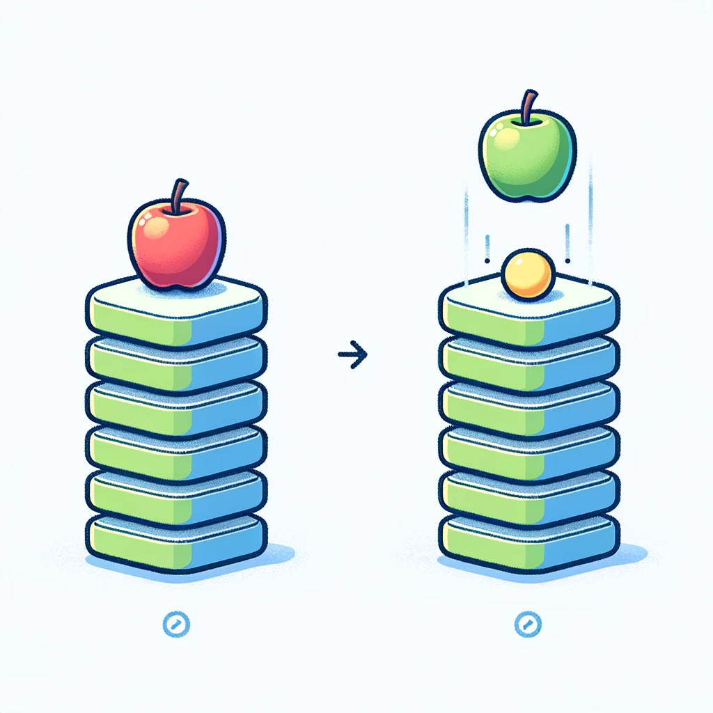

# Stack

### Introduction:

- **Python stacks** are a type of data structure that follow the Last In, First Out (LIFO) principle.
- It's not a built-in data type in Python, but can be easily implemented using lists.
- The main operations are push (to add an item), pop (to remove the most recently added item), and peek (to view the top item without removing it).

  

### Creating a Stack

```python
# Creating an empty stack
stack = []

# Pushing elements into the stack
stack.append('apple')
stack.append('ball')
stack.append('cat')
```

### Accessing Stack Elements:

- The `pop()` method is used to remove and return the top element of the stack.
- Use indexing `[-1]` to access the top element without removing it (peek operation).

```python
# Accessing the top element (peek)
top_element = stack[-1]   # Output: cat

# Popping the top element
popped_element = stack.pop()  # Output: cat

```

### Checking if Stack is Empty:

- To check if a stack is empty, you can simply check if the list is empty.

```python
# Check if stack is empty
is_empty = not stack
```

### Stack Length:

- Use the `len()` function to find the number of items in the stack.

```python
# Getting the length of the stack
stack_length = len(stack)
```

### Iterating Through a Stack:

- You can iterate through a stack using a loop, though it's not a common operation for stack data structures.

```python
# Iterating through a stack
for item in stack:
    print(item)
```

### Conclusion:

- Stacks in Python are simple to implement using lists and are useful for various applications where LIFO order is required.
- They offer operations for adding, removing, and accessing the top element, as well as checking if the stack is empty.

---

## Stack Operations

| Operation | Description                                   |
| --------- | --------------------------------------------- |
| append()  | Adds an item to the top of the stack          |
| pop()     | Removes and returns the top item of the stack |
| [-1]      | Accesses the top item without removing it     |
| len()     | Returns the number of items in the stack      |
| not stack | Checks if the stack is empty                  |

---

[https://www.youtube.com/watch?v=zwb3GmNAtFk](https://www.youtube.com/watch?v=zwb3GmNAtFk)

[https://www.youtube.com/watch?v=IxQHWt0GpsU](https://www.youtube.com/watch?v=IxQHWt0GpsU)
