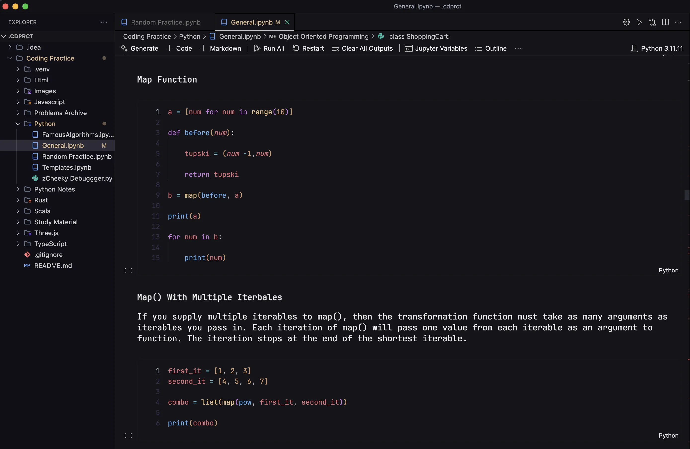

# Coding Practice

I've developed this project to act as a dynamic learning environment and a personal repository for my programming journey. The core of this project is a collection of Jupyter notebooks where I can seamlessly blend theory and practice. For any new concept or piece of syntax, I write detailed notes and immediately follow them with a runnable code cell to demonstrate and solidify my understanding.

This setup has become an indispensable part of my workflow, allowing me to learn and experiment with diverse languages like Python, Scala, and Rust all within one unified space. This hands-on methodology has significantly accelerated my learning, as it allows me to practice programming dynamically, reinforcing theory with immediate, practical application.

---

## Example

For example, here's a snapshot from when I was learning the `map` function in Python. As you can see, I use the space not just to jot down notes on how `map` works, but also to explore use cases and reinforce the concept through practice, all in one place.

	

---

## Long Term Goal

My long-term goal is to evolve this project into a public digital garden. The intention is to make my notes accessible to the community, creating a shared resource for others to learn from. I feel a responsibility to share this knowledge, as it's a culmination of information from the wider tech community, and I want to pay it forward.
